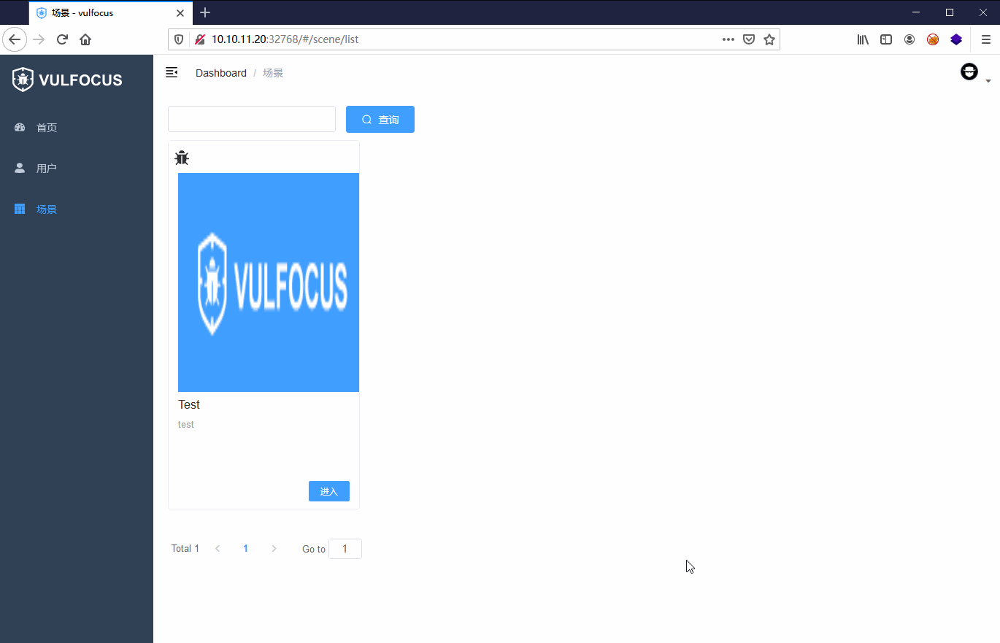
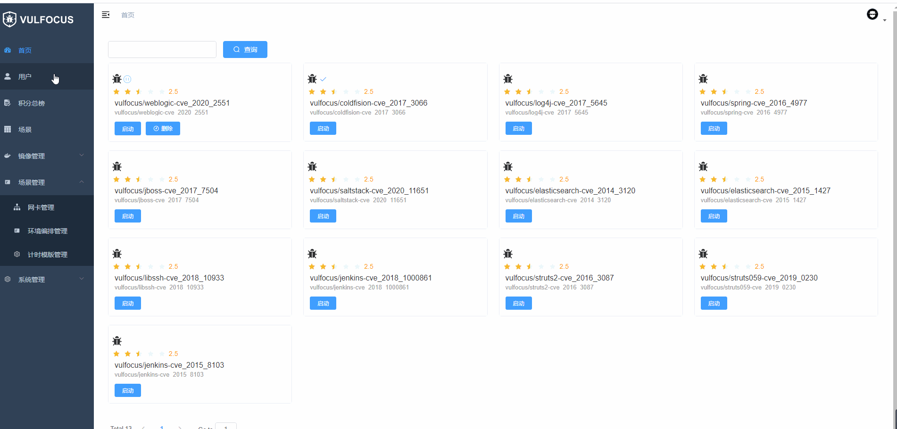

# vulfocus of java
原项目地址 [vulfocus](https://github.com/fofapro/vulfocus)。

使用java重构vulfocus后端项目 3.2.3版本

## 简介

Vulfocus 是一个漏洞集成平台，将漏洞环境 docker 镜像，放入即可使用，开箱即用。

Vulfocus 一个漏洞集成平台，所以可以无限向里添加漏洞环境没有限制，前提是你的内存足够大。因为漏洞环境是docker镜像的原因每次重新启动漏洞环境都会还原，不用出现你会对环境造成破坏下次无法启动的现象。

## 项目启动

### 前端

#### 安装项目依赖

进入前端项目后执行（不要使用cnpm，会出现很多bug）

```shell
npm install --registry=https://registry.npm.taobao.org
```

#### 项目启动

```shell
npm run dev
```

### 后端

```
VulfocusApplication.main()
```

Todo::将项目打包成docker镜像，从而实现一键启动

## 使用

1. 安装完成后，访问80端口

2. 用设置好的管理员账户登录

   

3. 首页为漏洞集成页面，刚开始是没有漏洞镜像的管理员需要在docker服务器上拉取镜像，之后通过本地导入的方式将镜像信息加载到数据库重，或自己以tar包的形式上传。

   

​	漏洞镜像的拉取和上传（**需管理员权限**）：

​		(1)、在镜像管理中，添加功能

​		(2)、分别填入漏洞名称、镜像、rank、描述

​		镜像又分为文件和文本文件：本地漏洞镜像打成tar包的形式上传。

4. 下载完成后点击启动即可。

5. 镜像启动后，会在环境里写入一个 flag （默认 flag 会写入 **/tmp/** 下），读取到 flag 后填入 flag 窗口，镜像会自动关闭，如需重新启动，需强刷一下，然后再次点击启动即可。

6. 可视化编排（管理员权限）

   

7. 场景模式（普通用户权限）

   

8. 时间模式（普通用户权限）

​	

## 环境搭建

- java 8

- springboot 2.3.7.RELEASE

- maven 3.6.1

- mysql5.7

- docker Desktop

  Docker version 20.10.24, build 297e128

  注意：需要开启远程访问，即能够访问2375端口

- RabbitMQ

- redis

### 导入数据

database.sql

运行脚本即可

### 导入docker-api依赖

```xm
<dependency>
            <groupId>com.github.docker-java</groupId>
            <artifactId>docker-java</artifactId>
            <version>${docker.version}</version>
            <exclusions>
                <!-- Conflict with kurento-jsonrpc-client -->
                <exclusion>
                    <groupId>io.netty</groupId>
                    <artifactId>*</artifactId>
                </exclusion>
            </exclusions>
        </dependency>
        <dependency>
            <groupId>com.github.docker-java</groupId>
            <artifactId>docker-java-core</artifactId>
            <version>${docker.version}</version>
        </dependency>
        <dependency>
            <groupId>com.github.docker-java</groupId>
            <artifactId>docker-java-transport-httpclient5</artifactId>
            <version>${docker.version}</version>
        </dependency>
        <dependency>
            <groupId>com.github.docker-java</groupId>
            <artifactId>docker-java-transport-okhttp</artifactId>
            <version>3.2.5</version>
        </dependency>
        <dependency>
            <groupId>com.github.docker-java</groupId>
            <artifactId>docker-java</artifactId>
            <version>${docker.version}</version>
            <exclusions>
                <!-- Conflict with kurento-jsonrpc-client -->
                <exclusion>
                    <groupId>io.netty</groupId>
                    <artifactId>*</artifactId>
                </exclusion>
            </exclusions>
        </dependency>
        <dependency>
            <groupId>com.github.docker-java</groupId>
            <artifactId>docker-java-core</artifactId>
            <version>${docker.version}</version>
        </dependency>
        <dependency>
            <groupId>com.github.docker-java</groupId>
            <artifactId>docker-java-transport-httpclient5</artifactId>
            <version>${docker.version}</version>
        </dependency>
        <dependency>
            <groupId>com.github.docker-java</groupId>
            <artifactId>docker-java-transport-okhttp</artifactId>
            <version>3.2.5</version>
        </dependency>
```

### 配置数据库、rabbitMQ

application.yml

```yaml
  application:
    name: vulfocus
  datasource:
    driver-class-name: com.mysql.cj.jdbc.Driver
    url: jdbc:mysql://127.0.0.1:3306/vulfocus?serverTimezone=UTC&userUnicode=true&useSSL=false&
    username: root
    password: root
  redis:
    host: 127.0.0.1
    port: 6379
    password:
    lettuce:
      pool:
        max-active: 10
        max-idle: 10
        min-idle: 1
        time-between-eviction-runs: 10s
  rabbitmq:
    host: 127.0.0.1
    port: 5672
    username: root
    password: 123456
    virtual-host: host1
    listener:
      type: simple
      simple:
        default-requeue-rejected: false # 消息被消费者拒绝消费
        acknowledge-mode: manual # 手动确认消息
```

### 配置docker

docker-java.properties

```java
DOCKER_HOST=tcp://127.0.0.1:2375
#DOCKER_TLS_VERIFY=1
#DOCKER_CERT_PATH=/home/user/.docker/certs
DOCKER_CONFIG=/home/user/.docker
api.version=1.23
registry.url=https://index.docker.io/v1/
```


## docker部署

deploy/docker-compose/docker-compose.yml

```yaml
version: "3"

services:
  # 定义 Spring Boot 应用程序所需要的服务（容器）
  vulfocus:
    # 构建镜像的路径。"." 表示 Dockerfile 文件所在的当前目录
    build: .
    # 指定容器名称
    container_name: vulfocus
    # 容器所要使用的端口号
    ports:
      - "8001:8001"
    # 指定容器启动后所需要等待的其它服务的启动时间
    depends_on:
      - database
      - redis
    # 环境变量设置
    environment:
      - PROFILES_ACTIVE=prod
      - DATASOURCE_URL=jdbc:mysql://database:3306/vulfocus?useSSL=false
      - DATABASE_USER=root
      - DATABASE_PASSWORD=root
      - REDIS_HOST=redis
      - REDIS_PORT=6379

  # 定义数据库服务（容器）
  database:
    image: mysql:5.7.26
    # network_mode: "host" # 如果需要容器使用宿主机IP(内网IP)，则可以配置此项
    container_name: database # 指定容器名称，如果不设置此参数，则由系统自动生成
    restart: unless-stopped # 设置容器自启模式
    command: mysqld
    environment:
      - TZ=Asia/Shanghai # 设置容器时区与宿主机保持一致
      - MYSQL_ROOT_PASSWORD=root # 设置root密码
    ports:
      - 3306:3306
    volumes:
      # 数据挂载目录自行修改哦！
      #      - /etc/localtime:/etc/localtime:ro # 设置容器时区与宿主机保持一致
      #      - /data/mysql/data:/var/lib/mysql/data # 映射数据库保存目录到宿主机，防止数据丢失
      - ./mysql/conf/my.cnf:/etc/mysql/conf.d/my.cnf # 映射数据库配置文件
      - ./mysql/init:/docker-entrypoint-initdb.d

  # 定义 Redis 服务（容器）
  redis:
    image: redis:alpine
    container_name: redis
    ports:
      - "6379:6379"
```

Dockerfile

```dockerfile
# 使用官方 OpenJDK 8 映像作为基础镜像
FROM openjdk:8-jdk-alpine

# 将当前目录下的所有 jar 包复制到容器中的 /app 目录下
COPY vulfocus-0.0.1.jar /app/

EXPOSE 8001
# 设置容器启动时执行的命令
ENTRYPOINT sleep 60 && java -Dspring.profiles.active=prod -Dspring.datasource.url=$DATASOURCE_URL -Dspring.datasource.username=$DATABASE_USER -Dspring.datasource.password=$DATABASE_PASSWORD -Dspring.redis.host=$REDIS_HOST -Dspring.redis.port=$REDIS_PORT  -jar /app/vulfocus-0.0.1.jar
```


## 使用技术

- JWT + redis 单点登录
- ThreadLocal
- docker-api 
- docker-compose创建环境
- yml文件构建
- RabbitMQ死信队列执行延时任务
- 前后端分离
- springboot异步执行@Asyc
- redis缓存

## 已实现功能

| 用户             | 镜像             | 容器           | 任务              | 系统日志         | 网卡模块 | 场景模式 | 计时模式 |
| ---------------- | ---------------- | -------------- | ----------------- | ---------------- | ---------------- | ---------------- | ---------------- |
| 注册、登录、注销 | 获取本地镜像，拉取镜像     | 启动容器       | 创建镜像任务      | 获取任务列表     | 创建网卡 | 构建docker-compose.yml | 计时模板 |
| 获取全部用户     | 批量导入本地镜像 | 停止容器       | 创建/启动容器任务 | 获取系统配置     | 删除网卡 | 创建场景 | 计时题目列表 |
| 获取用户排名     | 获取镜像列表     | 删除容器       | 停止容器任务      | 记录镜像相关日志 | 获取所有网卡 | 启动,关闭场景 | 计时模块排行 |
| 修改密码         | 修改镜像信息     | 获取容器列表   | 删除容器任务      | 记录容器相关日志 |  | 删除场景 | 计时模式关闭与开启 |
| 获取用户信息     | 删除镜像         | 校验flag       | 获取单个任务信息  | 记录用户相关日志 |  | 获取场景信息           |            |
|                  | 由镜像创建容器   | 倒计时关闭容器 | 批量获取任务信息  |                  |  | 提交flag，并计分 |  |

### 解释一下创建场景的意思

- 创建场景，就是使用docker-compose创建容器，实现复杂网络环境漏洞的复现，需要使用上面的网卡功能(实现docker-compose的功能)

  关键在于，将前端传递的图信息转换为docker-compose.yaml文件，使用docker-compose.yaml创建多个关联容器

  前端传递的图的节点关系

  

  转换为json格式就是下面的数据

  ```java
  {"nodes":[
      {"name":"Network","type":"Network","id":"2ihp4sdd27y0","x":360,"y":40,"icon":"data:image/png;base64,","width":200,"height":100,"initW":200,"initH":100,"classType":"T1","isLeftConnectShow":true,"isRightConnectShow":true,"containNodes":[],"attrs":{"id":"c392f65a-9302-4382-a668-53ccee8e4798","name":"demo","subnet":"192.168.5.1/24","gateway":"192.168.5.1","raw":{"net_work_id":"c392f65a-9302-4382-a668-53ccee8e4798","net_work_client_id":"3ac8dca0f95cf8a63f45a9e73f0d4b26bf0a8e1cea3d76817b305a1abad0ca2f","create_user":1,"net_work_name":"demo","net_work_subnet":"192.168.5.1/24","net_work_gateway":"192.168.5.1","net_work_scope":"local","net_work_driver":"bridge","enable_ipv6":false,"create_date":"2023-04-18T23:20:05.917299","update_date":"2023-04-18T23:20:05.917299"}},"isSelect":false},
      {"name":"Container","type":"Container","id":"49mc1oqura0","x":60,"y":160,"icon":"data:image/png;base64,","width":200,"height":120,"initW":200,"initH":120,"classType":"T1","isLeftConnectShow":false,"isRightConnectShow":true,"containNodes":[],"attrs":{"id":"34e27d68-f81b-47ad-baae-dda1a4edd55d","vul_name":"redis","name":"redis:latest","desc":"redis","port":"6379","open":true,"raw":{"image_id":"34e27d68-f81b-47ad-baae-dda1a4edd55d","status":{"status":"","is_check":false,"container_id":"","start_date":"","end_date":"","host":"","port":"","progress":0,"progress_status":"","task_id":"","now":1681831285},"image_name":"redis:latest","image_vul_name":"redis","image_port":"6379","image_desc":"redis","rank":2.5,"is_ok":true,"is_share":false,"create_date":"2023-04-18T23:20:55.651619","update_date":"2023-04-18T23:20:56.312785"}},"isSelect":false},
      {"name":"Container","type":"Container","id":"5hry5ipy6ok0","x":620,"y":220,"icon":"data:image/png;base64,","width":200,"height":120,"initW":200,"initH":120,"classType":"T1","isLeftConnectShow":true,"isRightConnectShow":false,"containNodes":[],"attrs":{"id":"34e27d68-f81b-47ad-baae-dda1a4edd55d","vul_name":"redis","name":"redis:latest","desc":"redis","port":"6379","open":true,"raw":{"image_id":"34e27d68-f81b-47ad-baae-dda1a4edd55d","status":{"status":"","is_check":false,"container_id":"","start_date":"","end_date":"","host":"","port":"","progress":0,"progress_status":"","task_id":"","now":1681831299},"image_name":"redis:latest","image_vul_name":"redis","image_port":"6379","image_desc":"redis","rank":2.5,"is_ok":true,"is_share":false,"create_date":"2023-04-18T23:20:55.651619","update_date":"2023-04-18T23:20:56.312785"}},"isSelect":true}],
      "connectors":[
          {"id":"1oo4tk0gc4m","type":"Line","strokeW":3,"color":"#768699","targetNode":{"x":360,"y":40,"id":"2ihp4sdd27y0","width":200,"height":100},"sourceNode":{"x":60,"y":160,"id":"49mc1oqura0","width":200,"height":120},"isSelect":false},
          {"id":"2poxxpk4rso","type":"Line","strokeW":3,"color":"#768699","targetNode":{"x":620,"y":220,"id":"5hry5ipy6ok0","width":200,"height":120},"sourceNode":{"x":360,"y":40,"id":"2ihp4sdd27y0","width":200,"height":100},"isSelect":false}]}
  ```

  所以后端要做的就是根据上面的json数据，构建出相对应的docker-compose.yml文件，如下图

  ```yaml
  networks:
    demo:
      external: true
  services:
    7h4vhg3c58w0:
      image: redis:latest
      networks:
      - demo
      ports:
      - ${VULFOCUS4E326730646D686E4D324D314F4863774C54597A4E7A6B3D}:6379
    t3a2i35fqv4:
      image: redis:latest
      networks:
      - demo
      ports:
      - ${VULFOCUS64444E684D6D6B7A4E575A78646A51744E6A4D334F513D3D}:6379
  version: '3.2'
  ```
  .env文件中保存映射端口的信息
  ```javascript
  VULFOCUS4E326730646D686E4D324D314F4863774C54597A4E7A6B3D=25138
  VULFOCUS64444E684D6D6B7A4E575A78646A51744E6A4D334F513D3D=20328
  ```


## 优化

### 镜像缓存优化

本想着把镜像信息按照每页的数量缓存到redis中，以减少数据库操作，提高效率，但是反而效率更低了，属实反向优化了


```java
List<String> imageStringList = stringRedisTemplate.opsForList()
    .range("cache:image:" + page, 0, -1);
if(imageStringList == null || imageStringList.size() == 0){
    wrapper.eq(true, ImageInfo::getOk, true);
    wrapper.orderBy(true, false, ImageInfo::getCreateDate);
    page(imageInfoPage, wrapper);
    // 向redis存数据
    List<ImageInfo> imageInfoList = imageInfoPage.getRecords();
    for (ImageInfo imageInfo : imageInfoList) {
        stringRedisTemplate.opsForList().rightPush("cache:image:" + page, JSON.toJSONString(imageInfo));
    }
} else {
    List<ImageInfo> imageInfoList = new ArrayList<>();
    // 从redis中取数据并解析
    for (String imageString : imageStringList) {
        ImageInfo imageInfo = JSON.parseObject(imageString, ImageInfo.class);
        imageInfoList.add(imageInfo);
    }
    imageInfoPage.setRecords(imageInfoList);
    imageInfoPage.setTotal(count());
}
```


加了缓存后的速度是没加的1/4，这是没想到的。

可能是json反序列化过程效率比较低导致的吧，所以个优化只能放弃。

### 用户rank优化

在统计用户分数时涉及到查询比较多，所以是一个很耗时的操作

优化前代码

```java
    @Override
    public Result getAllUser(int currentPage) {
        UserDTO user = UserHolder.getUser();
        System.out.println(user.getId());
        if (!user.getSuperuser()) {
            return Result.fail("权限不足！");
        }
//        LambdaQueryWrapper<UserUserprofile> queryWrapper = new LambdaQueryWrapper<>();
        Page<UserUserprofile> userprofilePage = new Page<>(currentPage, SystemConstants.PAGE_SIZE);
        page(userprofilePage);
        List<UserUserprofile> allUser = userprofilePage.getRecords();
        ArrayList<UserInfo> userInfos = new ArrayList<>();
        for (UserUserprofile userprofile : allUser) {
            userInfos.add(handleUserInfo(userprofile));
        }

        Page<UserInfo> userInfoPage = new Page<>();
        BeanUtil.copyProperties(userprofilePage, userInfoPage);
        userInfos.sort(new Comparator<UserInfo>() {
            @Override
            public int compare(UserInfo u1, UserInfo u2) {
                double diff = u2.getRank() - u1.getRank();
                if (diff > 0) {
                    return 1;
                } else if (diff < 0) {
                    return -1;
                }
                return 0;
            }
        });
//        userInfos.sort(Comparator.comparing(UserInfo::getRank));
        userInfoPage.setRecords(userInfos);
        return Result.ok(userInfoPage);
    }
```

加入缓存优化的代码

```java
 @Override
    public Result getAllUser(int currentPage) {
        UserDTO user = UserHolder.getUser();
        System.out.println(user.getId());
        if (!user.getSuperuser()) {
            return Result.fail("权限不足！");
        }
        int total = count();
        int start = (currentPage - 1) * SystemConstants.PAGE_SIZE;
        int end = Math.min(currentPage * SystemConstants.PAGE_SIZE, total);
        Page<UserInfo> userInfoPage = new Page<>();
        List<UserInfo> userInfos = new ArrayList<>();
        List<String> userInfoStrs = stringRedisTemplate.opsForList().range("user:rank", start, end);
        if (userInfoStrs == null || userInfoStrs.size() == 0) {
            // 获取所有用户列表
            List<UserUserprofile> userList = list();
            total = userList.size();
            for (UserUserprofile userprofile : userList) {
                userInfos.add(handleUserInfo(userprofile));
            }


            userInfos.sort(new Comparator<UserInfo>() {
                @Override
                public int compare(UserInfo u1, UserInfo u2) {
                    double diff = u2.getRank() - u1.getRank();
                    if (diff > 0) {
                        return 1;
                    } else if (diff < 0) {
                        return -1;
                    }
                    return 0;
                }
            });
            userInfos = userInfos.subList(start, end);
            // 根据rank排序后将信息放入到redis
            for (UserInfo u : userInfos) {
                stringRedisTemplate.opsForList().rightPush("user:rank", JSON.toJSONString(u));
            }
        } else {
            for (String userInfoStr : userInfoStrs) {
                userInfos.add(JSON.parseObject(userInfoStr, UserInfo.class));
            }
        }

        userInfoPage.setRecords(userInfos);
        userInfoPage.setTotal(total);
        return Result.ok(userInfoPage);
    }
```

优化前后的效率对比


提升了至原来接近原来的1/7，此次优化很成功


## TODO:5.5

花了一个月的时间，将上述提到的功能完成，前后端联调的过程很是折磨人，不想再改前端代码了。不过vue的鉴权和动态路由那一部分的代码还挺有意思的。

添加了时间模式，算是完成了所有的功能，但是测试不够多，可能还存在一些bug，后续遇到再改。

后续继续优化

# 效果展示


